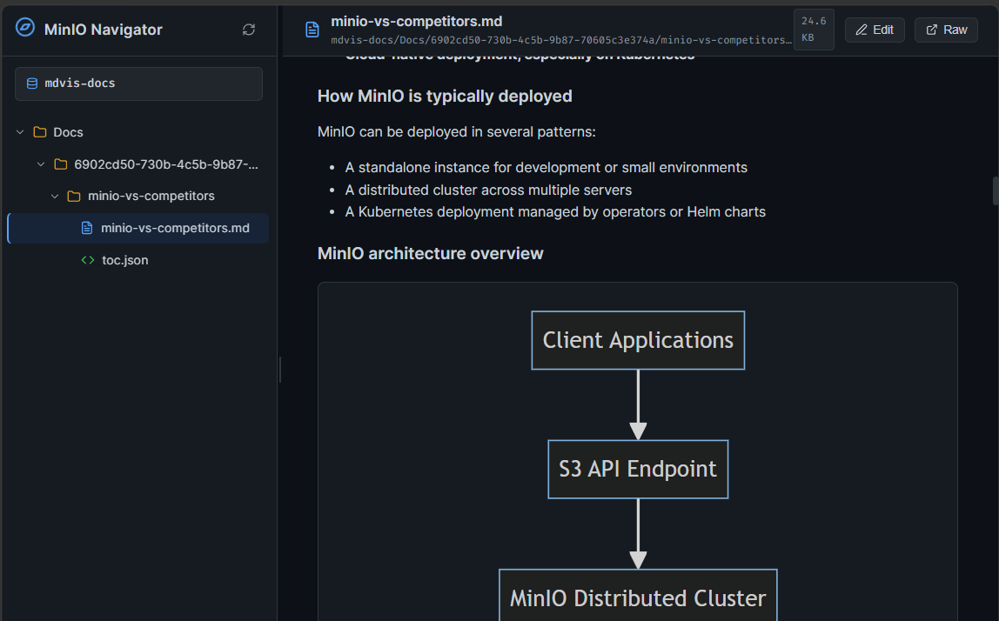
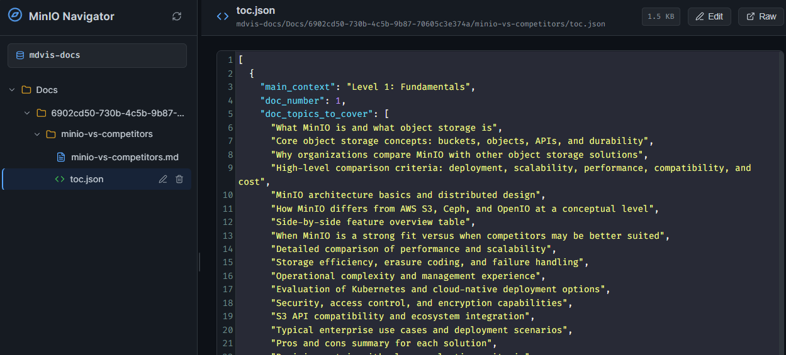
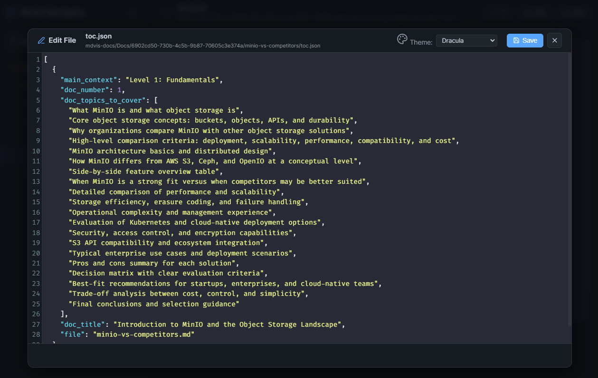

# MinIO Navigator

**MinIO Navigator** is a lightweight, modern application developed in Node.js to assist in directory navigation and file viewing on a local MinIO server (or any other service compatible with the S3 API). 

It offers a premium, responsive web interface with a dark theme (Dark Theme), focused on readability and interactivity of technical documents, containing native support for Markdown and interactive Mermaid diagram rendering.

> This project is only a simple developer tool, quickly created using Google's Antigravity and Gemini 3.5 Flash (Damn! This model is really fast and smart!) to help me navigate, view, and even edit files directly in MinIO buckets because its console interface is awful. Enjoy!
---

## Key Features

- **Dynamic Sidebar Treeview (Lazy-Loaded)**: Loads folders on demand as the user navigates. Folders are displayed before files, and everything is sorted alphabetically.
- **Flexible Splitter**: Allows adjusting the width of the navigation sidebar by dragging the border with the mouse.
- **Extensible File Viewer**:
  - **Markdown (`.md`)**: Rendered in clean and secure HTML (via `marked` and `DOMPurify`), with syntax highlighting in code blocks via **Highlight.js**.
  - **Text / Code (`.txt`, `.json`, `.yml`, etc.)**: Premium viewer with line numbers and syntax highlighting via **CodeMirror 5** (read-only mode).
  - **Unsupported Files**: Informative message display with a direct download/view link for the raw content.
- **Secure File Management**:
  - **Edit in Popup**: Allows editing text/markdown files directly in a popup/modal using CodeMirror. Includes a dropdown supporting 5 color themes (*Dracula*, *Monokai*, *Material Darker*, *Nord*, *Eclipse*) persisted in `localStorage`.
  - **Deletion**: Allows permanently deleting files or folders recursively directly in the sidebar (with a confirmation modal to prevent accidents).
- **Interactive Mermaid Diagrams**:
  - Renders ` ```mermaid ` code blocks directly as SVG in the document body.
  - Clicking on the diagram opens a **fullscreen popup** with advanced **Pan (drag)** and **Zoom (mouse wheel)** capabilities using the `Panzoom` library.

---

## Screenshots

Here are some visual examples of the application's main interface and features:

### 1. Markdown Viewer & Diagram Renderer
Allows viewing rich Markdown documentation with embedded, interactive Mermaid diagrams.


### 2. Text & Code File Viewer
Displays code files (like JSON, YAML, etc.) with custom themes, syntax highlighting, and line numbers.


### 3. Interactive File Editor
Allows modifying file contents directly through the web UI with a theme-switchable CodeMirror code editor modal.


---

## Requirements

- **Node.js** (version 16 or higher)
- A **MinIO** server running locally or remotely.

---

## Installation

1. Clone or extract the project files to your local directory.
2. Open the project folder in your terminal and install dependencies:
   ```bash
   npm install
   ```

---

## Configuration (`.env`)

Create a file named `.env` in the root of the project (use `.env.example` as a template). It must contain the following settings:

```env
# Port where the Node.js server will run
PORT=4000

# MinIO Connection Details
MINIO_ENDPOINT=localhost:9000
MINIO_USE_SSL=false
MINIO_ACCESS_KEY=your_access_key
MINIO_SECRET_KEY=your_secret_key

# Default Bucket name you wish to explore
# (If left blank, the root will display the list of all available buckets)
MINIO_BUCKET=mdvis-docs
```

---

## Running the Project

To start the web server:

### In Production
```bash
npm start
```

### In Development (automatically restarts when changing files)
```bash
npm run dev
```

After starting, access the dashboard through your browser:
👉 **[http://localhost:4000](http://localhost:4000)**

---

## Project Structure

```
minIONavigator/
├── .env.example        # Environment configuration template
├── .env                # Your active settings (not committed to Git)
├── package.json        # Node.js dependencies file
├── server.js           # Express Server & Integration with MinIO SDK
└── public/             # Interface and frontend assets
    ├── index.html      # HTML structure with CDN scripts
    ├── style.css       # Visual styling (dark theme and Markdown)
    └── app.js          # Frontend logic (splitter, treeview, renderers, and panzoom)
```

---

## Extending the Viewing Area

The application features a simple, decoupled architecture for file renderers inside the `public/app.js` file. If you want to add support for new types of files, such as rendering PDFs or images, simply register a new object in the `viewers` array:

```javascript
const viewers = [
  // Example of a new image viewer
  {
    name: 'Images',
    test: (filename) => /\.(png|jpe?g|gif|svg|webp)$/i.test(filename),
    render: async (bucket, path, container) => {
      container.innerHTML = `
        <div style="text-align: center; padding: 20px;">
          
        </div>
      `;
    }
  },
  // Default viewers already included ...
];
```
