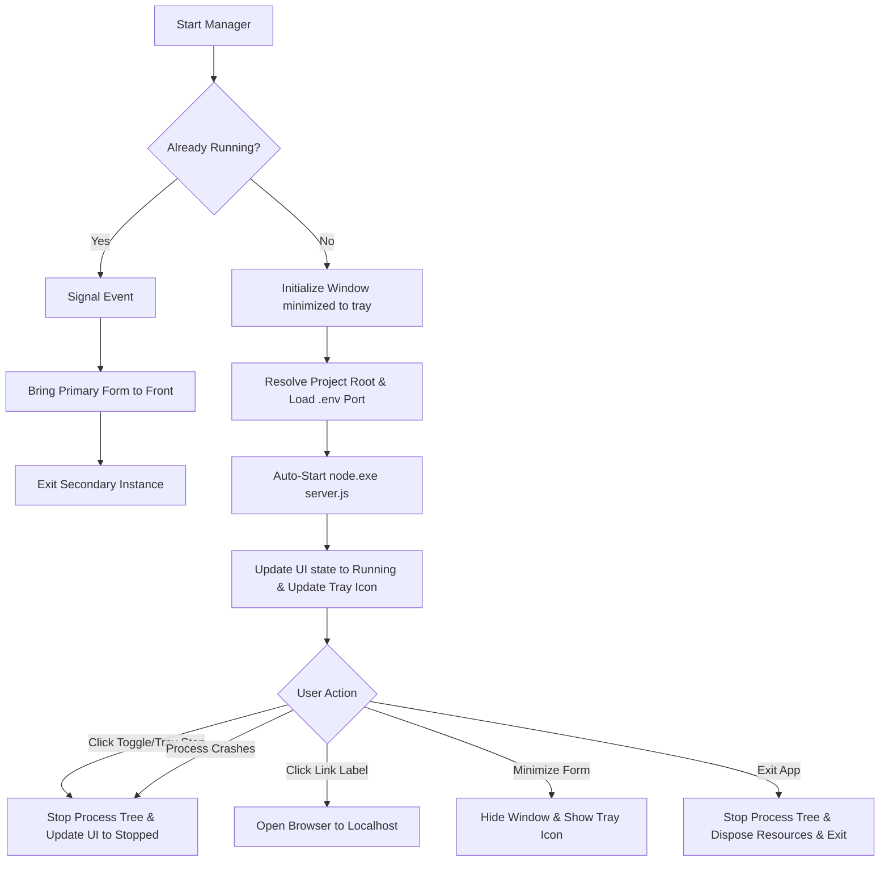

# Specifications: Windows Desktop Manager

This document describes the design, architecture, and implementation details of the **Windows Desktop Manager** for MinIO Navigator. The manager is a lightweight utility that coordinates the backend server process, provides status visualization, and integrates the application into the Windows system tray.

---

## 1. General Concept

The **Desktop Manager** is a native Windows application designed to simplify launching and running MinIO Navigator locally. It eliminates the need to open a terminal or command prompt window by wrapping the Node.js server lifecycle within a native C# system tray application.

### Key Goals:
- **Silent Background execution**: Start the Express server without displaying intrusive console windows.
- **System Tray Integration**: Minimize to the tray to stay running quietly in the background without cluttering the taskbar.
- **Process Protection**: Automatically ensure that the Node.js process tree is cleanly terminated when stopping the service or exiting the manager, preventing orphaned/leaked background server instances.
- **Configuration Synchronicity**: Read configuration directly from the shared project `.env` file to guarantee the manager and server agree on settings (like port numbers).
- **Single Instance Control**: Prevent starting multiple manager instances and bring the active window to the front if launched again.

---

## 2. Directory Structure

The files belonging to the manager are located in the `manager/` directory at the root of the project:

```
minIONavigator/
└── manager/
    ├── manager.csproj       # MSBuild project file (target framework, settings)
    ├── manager.csproj.user  # IDE user-specific metadata (design-time subtypes)
    ├── Program.cs           # Main entry point and single-instance mutex listener
    ├── Form1.cs             # Core application UI, tray menu, and process manager
    ├── Form1.Designer.cs    # Disposes components and holds designer boilerplate
    ├── icon.ico             # App icon used when the Node server is STOPPED (red dot)
    └── icon-running.ico     # App icon used when the Node server is RUNNING (green dot)
```

---

## 3. Technology Stack & Configuration

The application is built using modern Windows development tools:
- **Language**: C# 14
- **Runtime/SDK**: .NET 10.0
- **UI Framework**: Windows Forms (WinForms) configured via API without a Visual Studio designer grid (`InitializeComponentProgrammatic()`).
- **Target OS**: `net10.0-windows`
- **Output Type**: `WinExe` (Windows Executable)
- **Features**: Nullable Context enabled (`<Nullable>enable</Nullable>`) and Implicit Usings enabled (`<ImplicitUsings>enable</ImplicitUsings>`).

---

## 4. Main Components & Architecture

### 4.1 Program Entry Point (`Program.cs`)
Coordinates the single-instance guard and the listener that brings the primary window to the front.

- **Named Mutex**: Uses a global named mutex `Global\MinIONavigatorManager_SingleInstance` to detect if another instance is already running.
- **Named Event**: Uses a named EventWaitHandle `Global\MinIONavigatorManager_ShowEvent` to communicate between instances.
- **Behavior**:
  1. The application attempts to instantiate the mutex.
  2. If the mutex is already claimed (`createdNew == false`), it opens the existing named event, triggers `.Set()`, and immediately exits.
  3. If it is the first instance, it spawns a background thread named `SingleInstanceListener` that loops and blocks on `_showEvent.WaitOne()`.
  4. When signaled, it uses `BeginInvoke` or `Invoke` to execute `BringMainFormToFront()` on the main UI thread. This restores the window from minimized state, shows it in the taskbar, and calls `.Activate()` to focus it.

### 4.2 Application UI & Controls (`Form1.cs`)
Since the project relies on programmatic component layout rather than a drag-and-drop designer, the UI controls are initialized dynamically during instantiation:

- **Window Sizing**: Fixed size of `360 x 220` pixels. Resizing is disabled via `FormBorderStyle = FormBorderStyle.FixedSingle`, and `MaximizeBox` is set to `false`.
- **Startup Mode**: Starts minimized directly to the system tray on launch by overriding default behaviors:
  ```csharp
  this.WindowState = FormWindowState.Minimized;
  this.ShowInTaskbar = false;
  ```
- **Controls**:
  - `pnlStatusDot` (Panel): Rendered dynamically as a circular status indicator.
  - `lblStatus` (Label): Displays the current status in text (e.g., "Status: Parado", "Status: Executando").
  - `btnToggle` (Button): Large flat button that starts/stops the server.
  - `lnkUrl` (LinkLabel): Clickable hyperlink (e.g., `http://localhost:4000`) that opens the server URL in the system default web browser using `Process.Start` with `UseShellExecute = true`.

### 4.3 Process Lifecycle Management
The manager handles running and terminating the Node.js backend.

- **Starting**:
  - Spawns `node.exe` with the argument `server.js` using `ProcessStartInfo`.
  - Sets `WorkingDirectory` to the dynamically resolved project root.
  - Disables window creation using `CreateNoWindow = true` and `UseShellExecute = false`.
- **Exiting Monitoring**:
  - Subscribes to the process `Exited` event.
  - If the Node.js process crashes or is terminated outside the manager, a cross-thread UI invocation (`BeginInvoke`) resets the UI state back to "Stopped" and disposes of the process reference.
- **Stopping**:
  - Calls `Process.Kill(true)` to terminate the spawned Node process and all of its child processes recursively (process tree cleanup). This is critical to prevent leaving orphaned Node servers running on the machine's port.

### 4.4 Directory Resolution & Configuration Loading
- **Path Resolution**: The manager runs from `manager/bin/...` but must launch `server.js` from the project root. It dynamically crawls up directory parents from `AppDomain.CurrentDomain.BaseDirectory` until it finds the folder containing both `server.js` and `package.json`. If not found, it defaults to `D:\MyProjs_Temp\minIONavigator`.
- **Environment variables**: Reads the `.env` file at the resolved root path line-by-line, parsing out the `PORT` key to update the `LinkLabel` target URL (defaults to `4000` if missing or unparseable).

### 4.5 System Tray Integration (`NotifyIcon`)
Allows the manager to run without occupying space in the taskbar.

- **Minimize Behavior**: When minimized, the window hides itself (`this.Hide()`) and hides its taskbar item.
- **Restore Behavior**: Double-clicking (or left-clicking) the system tray icon restores the window back to its normal state (`WindowState = FormWindowState.Normal`, `ShowInTaskbar = true`, `.Activate()`).
- **Context Menu (`ContextMenuStrip`)**:
  - **Restaurar**: Shows and focuses the window.
  - **Abrir http://localhost:<PORT>**: Opens the application in the system default browser (enabled only when the server is running).
  - **Iniciar / Parar**: Performs the same operation as the toggle button on the main form.
  - **Sair**: Closes the application via `Application.Exit()`, executing `OnFormClosing` which disposes icons, closes the tray, and kills the Node process.

---

## 5. UI Layout & Visual States

The manager shifts colors, icons, and buttons dynamically based on whether the server process is active:

| Visual Element | Stopped State | Running State |
| :--- | :--- | :--- |
| **Window Icon & Tray Icon** | `icon.ico` (Red dot) | `icon-running.ico` (Green dot) |
| **Status Dot (`pnlStatusDot`)** | Slate Gray (`Color.FromArgb(127, 140, 141)`) | Green (`Color.FromArgb(39, 174, 96)`) |
| **Status Text (`lblStatus`)** | `Status: Parado` | `Status: Executando` |
| **Action Button (`btnToggle`)** | `Iniciar MinIO Navigator` (Blue background) | `Parar MinIO Navigator` (Tomato Red background) |
| **Hyperlink (`lnkUrl`)** | Hidden | Visible (`http://localhost:<PORT>`) |
| **Tray Context Menu Action** | `Iniciar` | `Parar` |
| **Tray Menu Open URL** | Disabled (`Abrir http://localhost:<PORT>`) | Enabled (`Abrir http://localhost:<PORT>`) |

---

## 6. Lifecycle Event Flowchart


